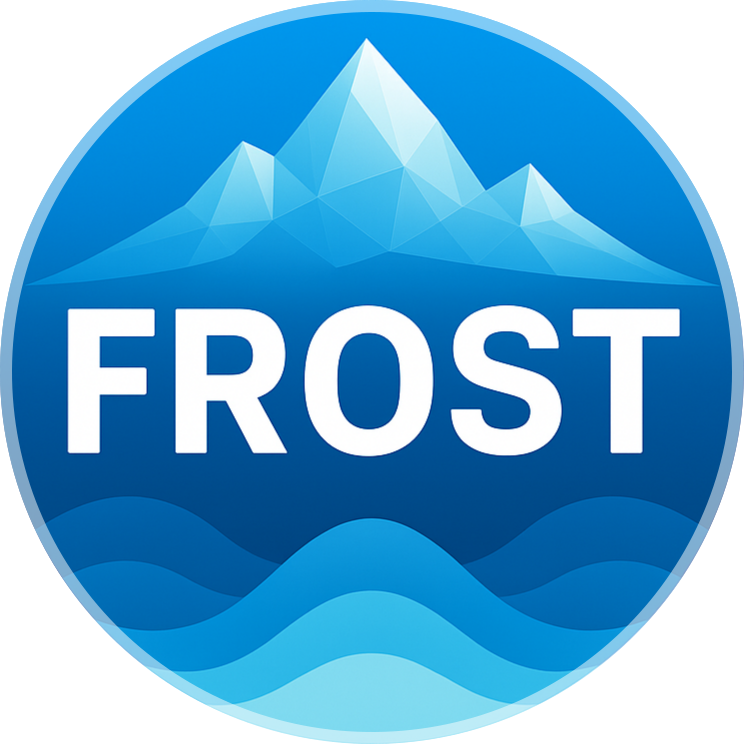
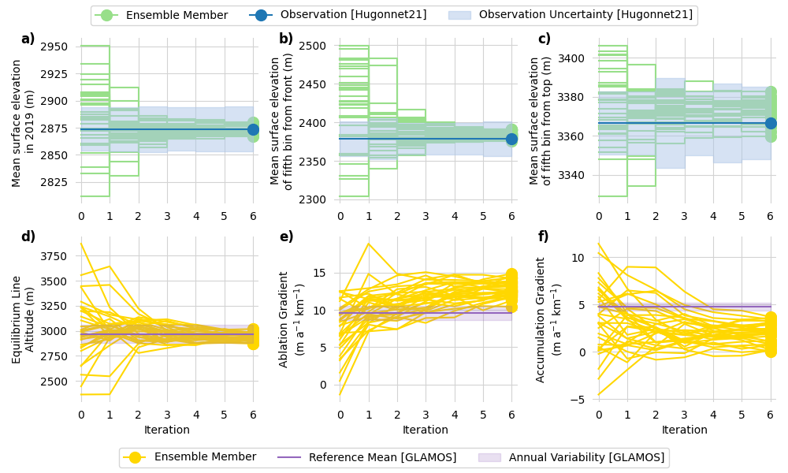

## **F**ramework for assimilating **R**emote-sensing **O**bservations for **S**urfacemass balance **T**uning


FROST is a data assimilation framework tailored for glacier modeling.
It couples the [IGM](https://github.com/instructed-glacier-model/igm) 3D glacier
model
with an Ensemble Kalman Filter (EnKF) to calibrate glacier-specific surface mass
balance (SMB) parameters using remote sensing observations. The method is
derivative-free, and scalable. It also provides uncertainty estimates alongside 
calibrated
results.

---

## 🏗️ Installation

1. Clone the repository

   ```bash
   git clone git@github.com:FAU-glacier-systems/FROST.git
   cd FROST
   git checkout hydra
   ```

2. Create a virtual environment with conda

   ```bash
   conda env create -f environment.yml
   conda activate frost_env
   ```

3. Install the IGM model next to FROST (Hydra-compatible)

   ```bash
   cd ..
   git clone https://github.com/jouvetg/igm 
   cd igm
   git checkout feature/hydra
   pip install -e .
   ```

---

## 🚀 Pipeline for Calibration 

1. Duplicate the `experiments/test_default` folder and rename it to your custom
   experiment name, e.g., `experiments/my_run`.
   Adapt the `config.yml` to your target glacier and desired setup e.g rgi_id
2. Download elevation change product and adapt the path in `config.yml`:
    https://www.sedoo.fr/theia-publication-products/?uuid=c428c5b9-df8f-4f86-9b75-e04c778e29b9
3. Run the pipeline

   ```bash
   python frost_pipeline.py --config experiments/<experiment-name>/config.yml 
   ```

4. View the results:

* **Calibration Results**
  `data/results/<experiment-name>/glaciers/<rgi-id>/calibration_results.json`

* **Monitoring Images**
  `monitor/status.png`

* **Example**
  

---

## 🏛️ Architecture

A schematic overview of the FROST calibration workflow:


---

## 📎 Reference

If you use FROST, please cite:

> Herrmann et al. (2025). A Kalman Filter-based Framework for Assimilating Remote
> Sensing Observations into a Surface Mass Balance Model. *Annals of Glaciology*, 66(
> 94).
> \[DOI & bibtex placeholder]

