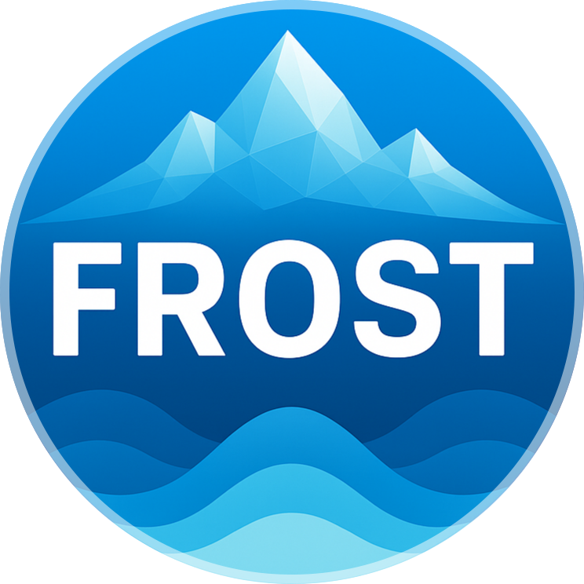
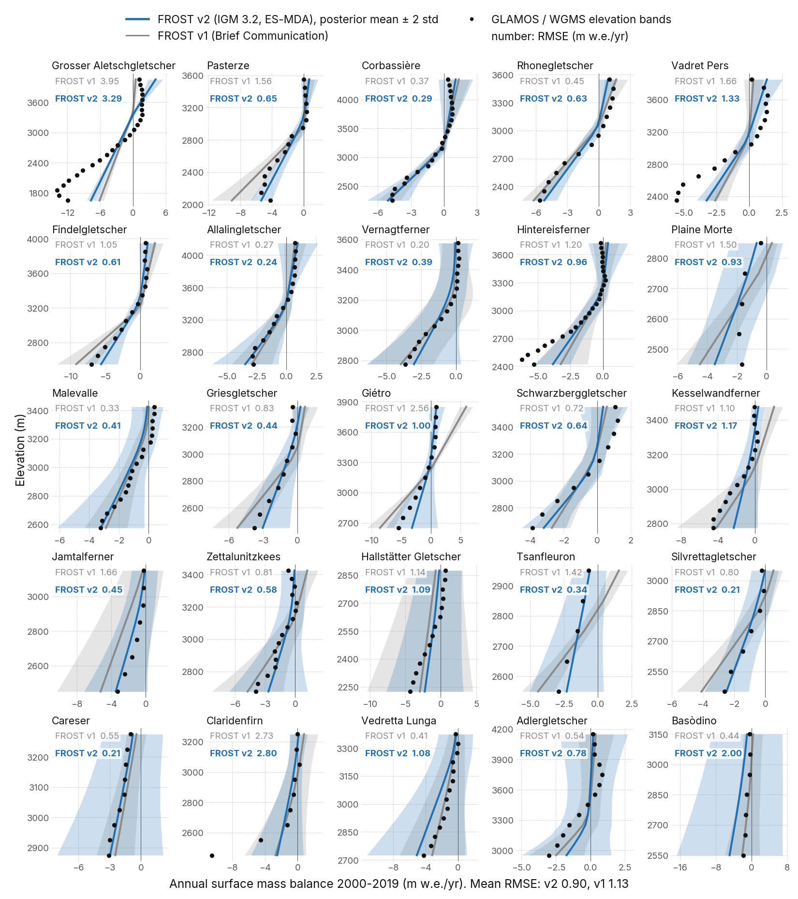
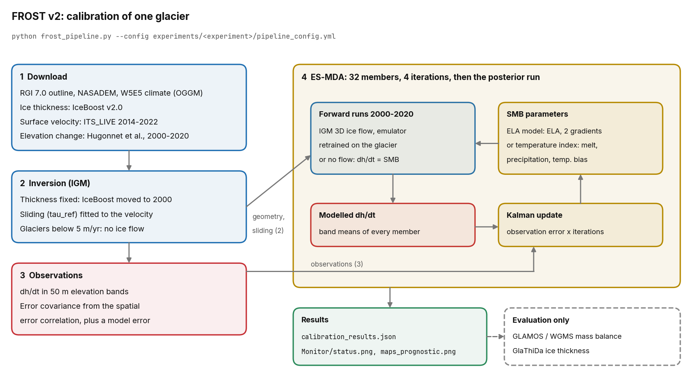
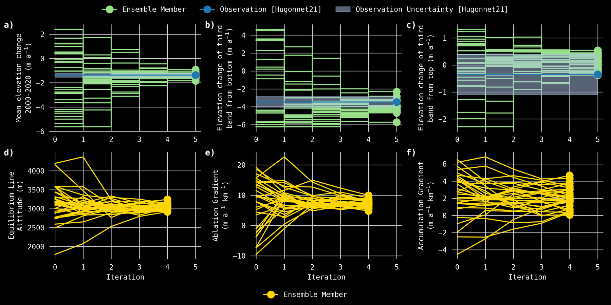
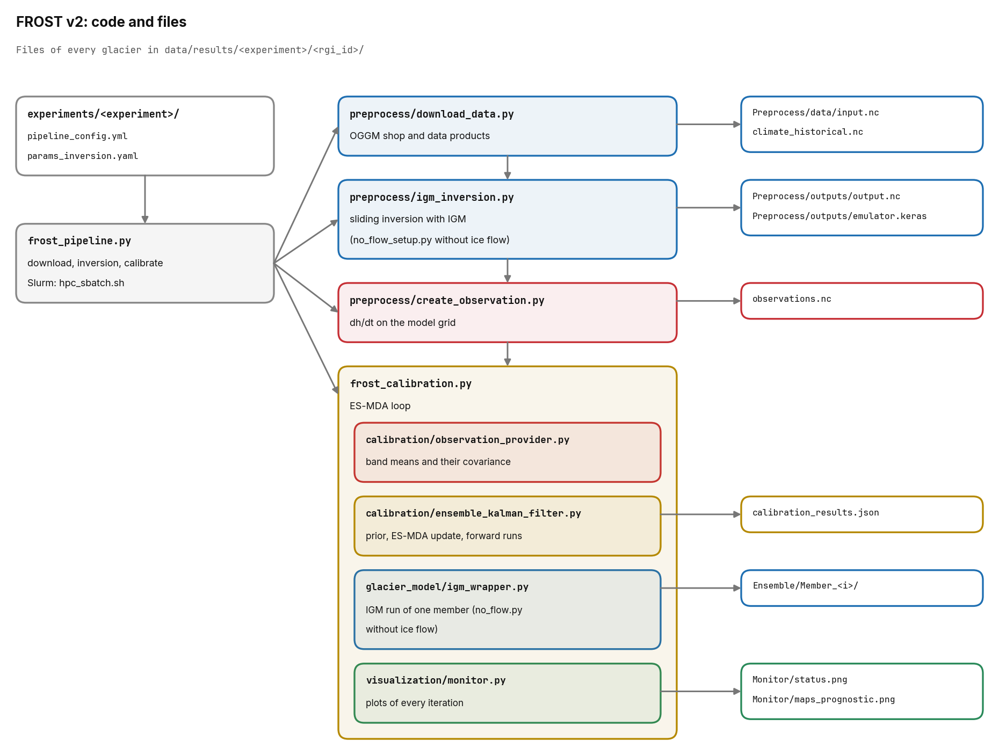

<h1>
  
  <b>F</b>ramework for assimilating <b>R</b>emote-sensing <b>O</b>bservations for <b>S</b>urface
  mass balance <b>T</b>uning<br>
</h1>


FROST is a data assimilation framework for glacier modelling. It couples the
3D glacier model [IGM](https://github.com/instructed-glacier-model/igm) with an
ensemble smoother (ES-MDA) to calibrate glacier-specific surface mass balance
(SMB) parameters against remote-sensing observations of elevation change. The
method is derivative-free and scalable, and it returns the posterior ensemble
of the parameters, so every result comes with its uncertainty. In-situ mass
balance (GLAMOS, WGMS) is used for evaluation only.

---

## ✨ What is new in v2.0

- **IGM 3.2** with the ice-flow emulator retrained on each glacier during the
  forward runs (no start-up speed shock).
- **ES-MDA** (Emerick & Reynolds 2013) instead of the iterated EnKF, so the
  observations count once; seeded, centred perturbed observations.
- **Observation error** of the elevation-band dh/dt from the spatial error
  correlation of Hugonnet et al. (2021), plus a model error per band.
- **Inputs** by default: IceBoost v2.0 ice thickness (moved to 2000 with the
  observed dh/dt) and ITS_LIVE surface velocity; the sliding field (tau_ref)
  is inverted on the geometry of the velocity year.
- **Glaciers without ice flow**: glaciers slower than 5 m/yr (ITS_LIVE 99th
  percentile on the ice) can be calibrated with dh/dt = SMB
  (`EnKF: ice_flow: none`), in milliseconds instead of minutes.
- **SMB models**: the ELA model (ELA and two gradients) and OGGM's monthly
  temperature-index model (melt factor, precipitation factor, temperature
  bias; optionally snow/ice melt factors and a calibrated lapse rate).

FROST v1 inferred the equilibrium line altitudes of 409 glaciers in the
European Alps ([Herrmann et al., 2026, The Cryosphere](https://doi.org/10.5194/tc-20-3817-2026)).
On the 25 of them with GLAMOS / WGMS measurements, v2 brings the SMB profiles
closer to the elevation-band mass balance: mean RMSE 0.90 instead of
1.13 m w.e./yr, and 88 % instead of 72 % of the bands within the 2-sigma
posterior spread.

<picture>
  <source media="(prefers-color-scheme: dark)" srcset="assets/smb_profiles_dark.png">
  
</picture>

*Posterior SMB profiles 2000-2019 of the 25 GLAMOS / WGMS glaciers. Drawn by
`experiments/central_europe_combined_retrain/readme_profiles.py`; the full
evaluation is in `experiments/README.md`.*

### Since v2.0 (development branch `v3-dev`)

- **IGM 3.3.0**, the latest IGM release, with IGM's own emulator
  retraining rules in the forward runs (`igm_wrapper.RETRAIN_RULES`;
  `emulator_retrain: true` takes `credit`: 300 iterations at the start, then
  5 whenever the glacier has changed enough, so the speed changes smoothly).
- **Faster**: one process keeps IGM's compiled ice-flow model and runs the
  ensemble members of a glacier one after the other (live IGM model, about
  7 s instead of 28 s per member on Rhonegletscher, identical results).
- **Both SMB models tested on the 25 GLAMOS / WGMS glaciers**
  (`experiments/igm330_live_combined` for ELA, `experiments/igm330_TI` for
  TI). Primary score: the elevation-band mass balance; ELA and gradients
  are a secondary check. The TI model also reproduces the year-to-year
  glacier-wide balance (median r 0.76 against 0.08 for the constant ELA
  model).

Known limitation: the calibration treats ice thickness and sliding as known.
Where the modelled ice flux into the tongue is too small (most clearly on
Grosser Aletschgletscher), the missing emergence is compensated by a flatter
SMB profile. Work on this is in `experiments/inversion_thickness`.

---

## 🏗️ Installation

FROST runs on Linux with Python 3.10; a GPU is recommended for the IGM
forward runs (CPU works, but slowly).

```bash
git clone https://github.com/FAU-glacier-systems/FROST.git
cd FROST
conda env create -f environment.yml     # environment igm32-frost
conda activate igm32-frost
python -m pytest tests/test_smoke.py    # imports and configs, a few seconds
```

`environment.yml` installs FROST itself (editable, with the test extras) and
IGM from GitHub at a fixed commit: IGM 3.3.0 plus a fix on IGM's main branch
without which the download step (an IGM run without ice flow) fails. Do not
install IGM separately with `pip install igm-model`; if you have an IGM
checkout, install that commit (see `environment.yml`). Check with
`python -c "import importlib.metadata as m; print(m.version('igm-model'))"`
(3.3.0). FROST v2.0 was run with IGM 3.2.1 plus 5 commits. The other
dependencies and their versions are listed in `setup.py`. The end-to-end
test runs the default setup on Rhonegletscher and needs a GPU
(`tests/run_end_to_end.sh` on a Slurm cluster).

The download step needs internet access (on a cluster, set the proxy in the
job script as `hpc_sbatch.sh` does).

### Data

| Data | Used for | How |
|---|---|---|
| Elevation change 2000-2020, Hugonnet et al. (2021) | calibration target | **download yourself** (step 2 below) |
| RGI 7.0 outline, DEM, GlaThiDa | glacier domain; thickness check | OGGM shop, by the pipeline |
| Monthly climate W5E5 (`climate_historical.nc`) and OGGM's own TI calibration (`mb_calib.json`) | TI model only | OGGM shop, by the pipeline |
| Ice thickness IceBoost v2.0 (or Millan et al. 2022) | start geometry | Zenodo, by the pipeline |
| Surface velocity ITS_LIVE (or Millan et al. 2022) | sliding inversion | ITS_LIVE, by the pipeline |
| GLAMOS (in `data/raw/glamos`), WGMS Fluctuations of Glaciers | evaluation only, never calibration | WGMS: download yourself for the evaluation scripts (`data/raw/README.md`) |

The ELA model needs no climate data. The TI model runs on the glacier's
W5E5 climate cell as OGGM provides it; other climate forcing (e.g. CORDEX
projections) must be in the same OGGM format (`experiments/alps_TI_projections`).

---

## 🚀 Pipeline for Calibration

<picture>
  <source media="(prefers-color-scheme: dark)" srcset="assets/pipeline_dark.png">
  
</picture>

1. **Set up an experiment.** Copy `experiments/test_default` to
   `experiments/<experiment-name>` and adapt `pipeline_config.yml`:
   - `experiment_name`, `rgi_id` (RGI 7.0, e.g. `RGI2000-v7.0-G-11-01706`)
   - `smb_model`: the SMB model to calibrate, `ELA` or `TI` (table below);
     `EnKF: smb_prior_mean` and `smb_prior_std` must hold its parameters,
     which the pipeline checks before it starts (the template has both
     blocks)
   - `EnKF`: prior mean and std of the SMB parameters, ensemble size,
     iterations, model error; `ice_flow: none` for glaciers that barely move
     (ITS_LIVE 99th percentile on the ice below 5 m/yr)
   - `params_inversion.yaml`: the sliding inversion (usually unchanged)

   | `smb_model` | `ELA` | `TI` |
   |---|---|---|
   | Model | SMB = gradient x (z - ELA), ablation and accumulation gradient; constant in time | OGGM's monthly temperature-index model: melt above -1 degC, snow below 0-2 degC |
   | Calibrated parameters | `ela` (m), `abl_grad`, `acc_grad` (m ice/yr per km) | `melt_f` (mm w.e. per degC day), `prcp_fac`, `temp_bias` (degC); optionally `temp_gradient` (K/km) |
   | Prior | in the config | `prior_from_oggm: true`: mean from OGGM's calibration of the glacier, std in the config |
   | Climate data | none | W5E5 monthly, from the download step |
   | Gives | mean SMB profile 2000-2020 | SMB of every year and month (projections with a climate forcing) |

   The run prints the SMB model and its parameters at the start, and
   `calibration_results.json` records them (`smb_model`, `parameters`).
2. **Get the elevation change.** Download the dh/dt tiles of Hugonnet et al.
   (2021) for your region and period and set `download: hugonnet_directory`,
   e.g. `data/raw/hugonnet/11_rgi60_2000-01-01_2020-01-01`:
   https://www.sedoo.fr/theia-publication-products/?uuid=c428c5b9-df8f-4f86-9b75-e04c778e29b9
   Everything else (outline, DEM, climate, thickness, velocity) is downloaded
   by the pipeline (table *Data* above).
3. **Run the pipeline.** `pipeline_steps` in the config switches the steps
   (download, inversion, calibration) on and off.

   ```bash
   python frost_pipeline.py --config experiments/<experiment-name>/pipeline_config.yml
   # another glacier with the same setup
   python frost_pipeline.py --config experiments/<experiment-name>/pipeline_config.yml --rgi_id <rgi_id>
   # on a Slurm cluster: one GPU job per glacier
   sbatch hpc_sbatch.sh experiments/<experiment-name>/pipeline_config.yml <rgi_id>
   ```

4. **Look at the results** in `data/results/<experiment-name>/<rgi_id>/`:
   - `calibration_results.json`: the SMB model (`smb_model`), its parameters
     (`parameters`, in the order of the columns of `final_ensemble`), the
     prior, the posterior ensemble, mean, std and the misfit of every iteration
   - `Monitor/status.png`: observations and parameters over the iterations;
     `Monitor/maps_prognostic.png`: observed and modelled maps of dh/dt,
     velocity, flux divergence and SMB (`monitor_plots: all` keeps one file
     per iteration)
   - `Preprocess/`: inputs and the inversion; `observations.nc`; `Ensemble/`:
     the runs of the members (large, can be deleted)

**Example**: `Monitor/status.png` of Rhonegletscher with the default setup.
Top: mean dh/dt of the glacier and of two elevation bands, the members (green)
against the observation and its error (blue); bottom: ELA and the two
gradients of the members over the four ES-MDA iterations.



`experiments/README.md` describes the reference setup and the experiments
behind the v2 defaults.

---

## 🏛️ Architecture

<picture>
  <source media="(prefers-color-scheme: dark)" srcset="assets/architecture_dark.png">
  
</picture>

The diagrams are drawn by `tools/readme_diagrams.py`.

---

## 📎 Reference

If you use FROST, please cite the method paper:

Herrmann, O. et al. (2025) ‘A Kalman filter-based framework for assimilating remote sensing observations into a surface
mass balance model’, Annals of Glaciology, 66, p. e23. doi:10.1017/aog.2025.10020.

Application to the glaciers of the European Alps (FROST v1):

Herrmann, O., Prasad, V., Zöller, A., Groos, A. R., Cook, S., Sommer, C., and Fürst, J. J. (2026)
‘Brief communication: Inferring Glacier Equilibrium Line Altitudes in the Europe Alps with FROST’,
The Cryosphere, 20, pp. 3817–3825. doi:10.5194/tc-20-3817-2026.

Data used by default: Hugonnet et al. (2021, Nature 592, 726) elevation
change; IceBoost v2.0 ice thickness (Maffezzoli et al.); ITS_LIVE velocity
(Gardner et al.); RGI 7.0 outlines and W5E5 climate through the OGGM shop.

---

## ⚖️ License

FROST is free software under the GNU General Public License v3.0 (`LICENSE`).
Code adapted from IGM (GPL-3.0) and OGGM (BSD-3-Clause), the bundled fonts
(SIL Open Font License) and the reference data in `data/raw/` keep their own
licenses: see `THIRD_PARTY_NOTICES.md` and `data/raw/README.md`.
